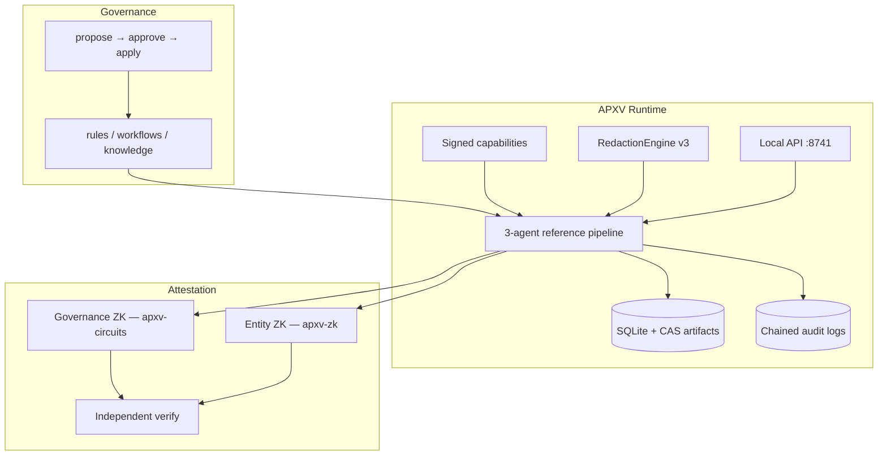

# APXV — Project Guide

**APXV** (*Attested Proof Execution Verified*) is an air-gapped governed agent platform.

**Version:** 1.3.3 · **License:** Apache 2.0

This guide describes the repository layout, core components, and documentation index. For a quick start, see [README.md](README.md) and [docs/QUICKSTART.md](docs/QUICKSTART.md).

---

## What APXV Provides

APXV is an air-gapped governed agent platform: markdown rules, signed capabilities, chained audit, Groth16 proofs, local API — bring your own LLMs. Legacy code modules retain `APX*` aliases (e.g. `APXRuntime = APXVRuntime`) for one release; new artifacts use `APXV-*` IDs.

| Capability | Description |
|------------|-------------|
| **Governance specs** | Rules, workflows, and knowledge as markdown under `managed/` |
| **Signed capabilities** | Per-agent permissions in `managed/config/capabilities.json` |
| **Audit chain** | Chained logs for system and agent events |
| **Artifact store** | SQLite index + content-addressable blobs |
| **Approval workflow** | Propose → approve → apply for governance changes |
| **Redaction engine v3** | Format-aware pattern redaction with `entities[]` output |
| **Optional E2EE** | `APXE2EE` encryption (`--encrypt` on pipeline) |
| **Dual-track ZK** | 3 governance circuits + entity proofs per attest (`merkle-inclusion`, `compliance`, and more; 8 circuits in crate) |
| **Voice privacy** | STT → redact → attest (`agents/voice/`; simulated or local Vosk/pyttsx3) |
| **Ceremony (Tier A/B)** | VK manifest transcript (+ signature when signing keys exist) + exportable verifier bundle |
| **Local API** | HTTP on `127.0.0.1:8741` — no cloud, no telemetry |
| **Pluggable LLMs** | Optional backends (Ollama example included) |

APXV is a **foundation for builders** — not a finished consumer product and not HIPAA/SOC2/GDPR certified. See [SECURITY.md](SECURITY.md) for the threat model.

---

## Release Status

| Milestone | Status |
|-----------|--------|
| Cryptography & ZK attestation | Complete |
| Governed runtime core | Complete |
| Privacy features (redaction, E2EE, dual ZK) | Complete |
| Voice suite + ceremony transparency (v1.1) | Complete |
| Onboarding & packaging | Complete (install scripts, doctor, Docker, examples, CI) |
| Official agent packs (v1.2) | Reference Redaction, Document Processing, AI Governance |
| Current version | **v1.3.3** |

The reference 3-agent pipeline (redact → orchestrate → attest), three official pack smoke tests, voice path, dual-track Groth16 verification, sovereign bootstrap, and API v2 are covered by **797 automated tests** (2 skipped when Vosk/voice deps absent; see `python -m pytest tests/ -q`).

---

## Architecture



| Layer | Components |
|-------|------------|
| **Privacy** | `APXRedactionEngine`, optional `APXE2EE` |
| **Deterministic core** | RuleGovernedRedactor, WorkflowOrchestrator, AttestationCoordinator |
| **Agentic layer** | `LLMBackend`, `LLMReasoner`, `ToolUser`, `AgenticContract` |
| **Governance & control** | CapabilityChecker, AuditLogger, GovernanceRegistry |
| **Cryptographic layer** | Dual Groth16 tracks over BN254 (arkworks) |

**Packs vs platform:** APXV core provides the runtime and 3-agent pipeline pattern. [Agent packs](governance-libraries/) supply governance specs, install steps, and acceptance for a vertical — they bind to core agents rather than replacing the runtime. See [README.md](README.md#agent-packs--extend-the-foundation).

---

## Repository Layout

### Runtime (`agents/`)

| Component | File(s) | Role |
|-----------|---------|------|
| Reference pipeline | `agent1.py` … `agent3.py` | Redaction, orchestration, attestation |
| Redaction v3 | `redaction/` | Format parser, patterns, `APXRedactionEngine` |
| Encryption | `encryption_engine.py` | `APXE2EE` (optional pipeline encryption) |
| ZK bridge | `zk/` | Entity commitments, Merkle tree, dual proof bundle |
| Voice privacy | `voice/` | STT/TTS providers, `VoicePrivacyPipeline` |
| Runtime | `runtime.py` | Store, audit, capabilities, governance |
| Local API | `local_api.py` | Auth, jobs, pipeline, health |
| LLM integration | `llm_backend.py`, `llm_reasoner.py` | Pluggable model backends |
| Policy & governance | `capability_policy.py`, `governance_approval.py` | Signed policy and spec approval |

### Cryptography (`rust/`)

| Component | Role |
|-----------|------|
| `apxv-circuits/` | Governance Groth16 circuits: redaction, rule-binding, pipeline |
| `apxv-zk/` | Entity Groth16 circuits (8 in crate; 3–4 + voice on default attest — see `docs/cryptography/CIRCUITS.md`) |
| `apxv-circuits/keys/` | Reference governance `.pk`/`.vk` + `manifest.json` (re-run setup for your own keys) |
| `apxv-zk/keys/` | Reference entity `.pk`/`.vk` + `entity-manifest.json` (re-run setup for your own keys) |

### Scripts and CLI (`scripts/`)

| Command | Purpose |
|---------|---------|
| `install.ps1` / `install.sh` | Native one-command install (`-Fresh` / `--fresh`) |
| `install-docker.ps1` / `install-docker.sh` | Docker-only one-command install |
| `onboard.py` | Guided onboarding (setup → pack → attest → verify) |
| `setup_first_run.py` | First-run setup (governance + entity ZK by default) |
| `setup_entity_zk.py` | Entity circuit trusted setup only |
| `apxv_doctor.py` | Prerequisites and health check |
| `apxv_ctl.py` | Integrity, API keys, governance, backups |
| `run_apx.py` | Full pipeline (`--attest`, `--voice-transcript`, `--voice-file`, optional `--encrypt`) |
| `verify_attestation.py` | Independent dual-track ZK verification (`--real-zk`) |
| `ceremony_transcript.py` | Tier A/B ceremony transcript write/verify |
| `export_verifier_bundle.py` | Publishable VK-only bundle for releases |
| `setup_voice.py` | Download Vosk model for local STT |
| `run_voice_demo.py` | Standalone voice privacy demo |
| `apxv_serve.py` | Local HTTP API |

### Examples & templates

| Path | Purpose |
|------|---------|
| `examples/hello-agent/` | Minimal custom governed agent |
| `examples/api-client/` | Python API client |
| `examples/llm-ollama/` | Local LLM via Ollama |
| `governance-libraries/` | Official packs (`apxv-pack-reference-redaction`) and governance templates |

### Deployment

| Asset | Notes |
|-------|-------|
| `Dockerfile` | Rust 1.85; ZK keys baked at build |
| `docker-compose.yml` | Port 8741; mounts both key directories |
| `docs/AIR-GAP-INSTALL.md` | Offline installation |

---

## Quality Assurance

| Check | Coverage |
|-------|----------|
| Unit & integration tests | `tests/` (797 in CI, 2 skipped; voice, ceremony, packs, dual ZK E2E, integrity diagnostics) |
| Rust tests | `cargo test` in `apxv-circuits` + `apxv-zk` |
| CI | `.github/workflows/ci.yml` — pytest, voice extras, ceremony, setup, doctor, integrity |
| Independent ZK verify | `python -m scripts.verify_attestation --real-zk` |

If `apxv_doctor` reports a broken audit chain on a long-lived dev tree, reset local audit state and re-run setup:

```bash
# Remove polluted audit logs, then:
python -m scripts.setup_first_run
```

Fresh installs and CI environments should report **HEALTHY** without this step.

---

## Documentation Index

| Document | Audience |
|----------|----------|
| [README.md](README.md) | Overview and quick links |
| [docs/QUICKSTART.md](docs/QUICKSTART.md) | First install and verify |
| [docs/BUILDING.md](docs/BUILDING.md) | Custom agents, API, LLMs |
| [docs/LOCAL-API.md](docs/LOCAL-API.md) | HTTP API reference |
| [docs/DOCKER.md](docs/DOCKER.md) | Container deployment |
| [docs/AIR-GAP-INSTALL.md](docs/AIR-GAP-INSTALL.md) | Offline install |
| [docs/INSTALL-RUST.md](docs/INSTALL-RUST.md) | Rust toolchain |
| [docs/cryptography/](docs/cryptography/) | ZK setup, circuits, ceremony, verification |
| [SECURITY.md](SECURITY.md) | Threat model |
| [docs/security/SECURITY-ARCHITECTURE.md](docs/security/SECURITY-ARCHITECTURE.md) | Security architecture |
| [CONTRIBUTING.md](CONTRIBUTING.md) | Contribution guidelines |
| [CHANGELOG.md](CHANGELOG.md) | Release history |
| [ROADMAP.md](ROADMAP.md) | Public direction |
| [RUNBOOKS/](RUNBOOKS/) | Deployment and operations |

---

## Contributing

See [CONTRIBUTING.md](CONTRIBUTING.md). Bug reports should include output from `python -m scripts.apxv_doctor` and steps to reproduce.