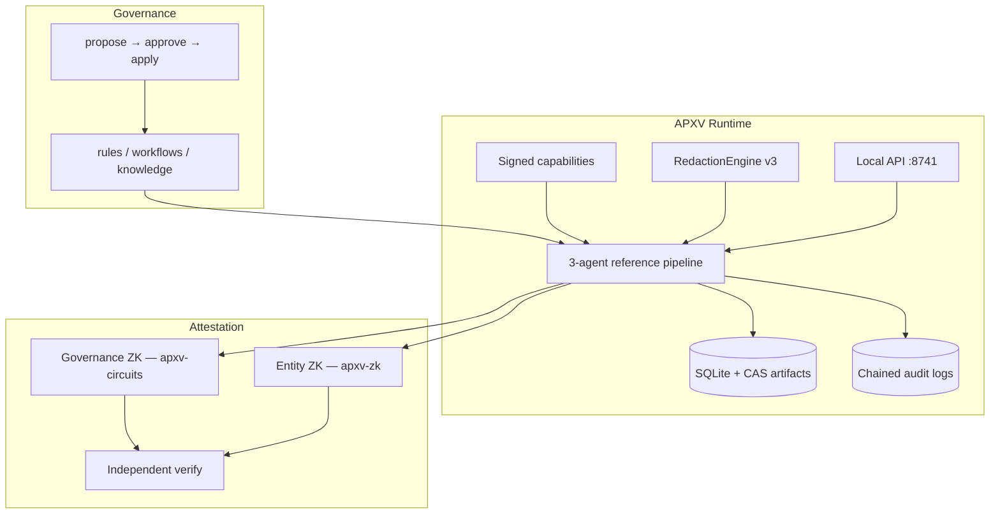

# APXV™ https://apxv-official.github.io/APXV/

[](https://github.com/APXV-Official/APXV/actions/workflows/ci.yml)

**APXV** (*Attested Proof Execution Verified*) is an air-gapped governed agent platform: markdown rules, signed capabilities, chained audit, Groth16 proofs, and a local API — bring your own LLMs. This repository ships **APXV**, the first open-source implementation.

> **Version 1.5.0** — **Studio** (Agents, Packs, Proof Profiles), **Workbench**, **Trust** hub, and optional catalog claim proofs. [CHANGELOG](CHANGELOG.md) · [Site](https://apxv-official.github.io/APXV/) · [Downloads](docs/DOWNLOADS.md) · [Migration from v1.4.x](docs/MIGRATION-v1.5.md)

## Downloads

Desktop installers (Windows MSI/NSIS, Linux deb/AppImage): **[GitHub Releases — latest](https://github.com/APXV-Official/APXV/releases/latest)** · full table in [docs/DOWNLOADS.md](docs/DOWNLOADS.md) · step-by-step [INSTALL-USER.md](docs/INSTALL-USER.md).

Install APXV on your machine. Your instance generates **your** proving keys, runs governed pipelines, and produces proofs you can verify locally. No vendor keys in Docker images; no cloud trust boundary.

## Install paths

| Path | Who | Action |
|------|-----|--------|
| **Desktop** | Individual operators | [Download latest installers](https://github.com/APXV-Official/APXV/releases/latest) · [INSTALL-USER.md](docs/INSTALL-USER.md) |
| **Docker** | Teams, no local Rust | `.\scripts\install-docker.ps1` or `./scripts/install-docker.sh` |
| **Native** | Contributors | `.\scripts\install-full.ps1` or `./scripts/install-full.sh` |

Polluted from prior experiments? Add `-Fresh` (PowerShell) or `--fresh` (shell).

**What it runs:** `apxv_bootstrap` (sovereign ZK) → doctor → integrity → **Reference Redaction Pack** → `run_apxv --attest` → `verify_attestation --real-zk`

**You should see:**

```
Pack demo complete: final_status=ATTESTED, total_redactions=4
ALL GOVERNANCE + ENTITY GROTH16 PROOFS INDEPENDENTLY VERIFIED [OK]
```

First native install with sovereign bootstrap typically takes **20–60 minutes** (Rust compile plus 3 governance + 6 entity circuit setup). Docker build is slower once, then cached.

Re-run without reinstalling: `python -m scripts.onboard --skip-setup`

**Linux / WSL:** use `python3` or activate `.venv/bin/activate` if `python` is not on PATH.

**API key:** printed once at onboard, saved to `managed/config/OPERATOR-KEY-*.txt`, or create with `python -m scripts.apxv_ctl api-key create my-app --save-hint`.

Details: [docs/QUICKSTART.md](docs/QUICKSTART.md)

## 5-minute path

**Already set up** (`setup_first_run` done)? Run a pack demo, full attest, and independent verify in one step:

| Platform | Command |
|----------|---------|
| **Windows** | `.\scripts\apxv_demo.ps1` |
| **macOS / Linux / WSL** | `./scripts/apxv_demo.sh` |

```bash
./scripts/apxv_demo.sh --pack reference   # default — same as onboarding
./scripts/apxv_demo.sh --pack document    # batch .txt/.json, compliance policy 2
./scripts/apxv_demo.sh --pack ai          # LLMReasoner review, compliance policy 4
./scripts/apxv_demo.sh --pack all         # all three pack demos, then attest + verify
```

Equivalent: `python -m scripts.apxv_demo --pack document`

On success you get `ALL GOVERNANCE + ENTITY GROTH16 PROOFS INDEPENDENTLY VERIFIED [OK]` plus the **artifact path** under `managed/artifacts/`.

## Operator UI

With sovereign bootstrap done and the API running:

```bash
# Terminal 1 — runtime
python -m scripts.apxv_serve

# Terminal 2 — UI (from ui/ in the full monorepo checkout)
cd ui && pnpm install && pnpm dev
```

Open http://127.0.0.1:5173 → paste operator API key. The console is organized as:

| Area | Purpose |
|------|---------|
| **Workbench** | Assemble pipelines from the shelf, bind a proof profile, run |
| **Studio** | Author Agents, Packs, and Proof Profiles (Save → Test → Promote) |
| **Runs** | Job queue (route remains `/jobs`) |
| **Trust** | Verify, Audit, and Governance in one hub |
| **Pack wizard** | Advanced pack authoring still at `/packs?wizard=1` |

Docs: [ui/docs/OPERATOR-GUIDE.md](ui/docs/OPERATOR-GUIDE.md) · Proofs: [docs/PROOF-STUDIO.md](docs/PROOF-STUDIO.md) · Pack index: [docs/PACK-CATALOG.md](docs/PACK-CATALOG.md)


**Fresh machine, Docker only** (~5 minutes after the first image build):

```bash
./scripts/install-docker.sh
curl http://127.0.0.1:8741/health
```

No local Python or Rust required. See [docs/DOCKER.md](docs/DOCKER.md).

## The foundation

APXV is a **runtime you build on** — not a finished end-user product. The core repo gives you:

| Capability | What it means |
|------------|---------------|
| **Living governance** | Agents read `managed/rules`, `workflows`, and `knowledge` at runtime — not hardcoded prompts |
| **Controlled change** | Rule updates go through propose → approve → apply; audit chain records every action |
| **Signed capabilities** | Each agent is granted explicit permissions; policy is verified before execution |
| **Immutable artifacts** | Pipeline outputs land in SQLite + content-addressable storage |
| **Dual-track Groth16 ZK** | Governance proofs (3 circuits) + entity proofs (6 default sovereign circuits) over BN254 |
| **Local API** | HTTP on `127.0.0.1:8741` — no cloud, no telemetry |
| **Optional voice + E2EE** | Voice privacy suite and payload encryption when you need them |

The **3-agent reference pipeline** (redactor → orchestrator → attestation coordinator) is the pattern packs plug into. Core ships the agent machinery; packs supply the governance and vertical logic for a use case.

**Who this is for:** developers and teams building privacy-preserving agent pipelines on local infrastructure — with auditable rule changes, immutable artifacts, and cryptographically verifiable execution.

## Agent packs — extend the foundation

A **pack** is a vertical bundle on top of APXV: governance specs, install steps, a runnable acceptance path, capability notes, and an acceptance checklist. You install only what you need; multiple packs can share one runtime.

### What's available today

| Artifact | Type | What you get |
|----------|------|--------------|
| [Reference Redaction Pack](governance-libraries/apxv-pack-reference-redaction/) | **Official pack** | Sensitive-text redaction → orchestration → attestation |
| [Document Processing Pack](governance-libraries/apxv-pack-document-processing/) | **Official pack** | Batch `.txt` / `.json` folder ingest, compliance policy 2 |
| [AI Governance Pack](governance-libraries/apxv-pack-ai-governance/) | **Official pack** | Redaction + `LLMReasoner` review, compliance policy 4 |
| [AI governance template](governance-libraries/ai-governance-template/) | **Template** | Starter markdown — prefer the AI Governance Pack for a full install path |
| [governance-libraries/](governance-libraries/) | **Index** | Packs vs templates |

### Build your own

| Goal | Start here |
|------|------------|
| Studio (Agents, Packs, Proof Profiles) | `/studio` — Save → Test → Promote |
| Tutorial | [docs/BUILD-YOUR-FIRST-PACK.md](docs/BUILD-YOUR-FIRST-PACK.md) |
| Custom agent on the runtime | [docs/BUILDING.md](docs/BUILDING.md) |
| Minimal worked example | [examples/hello-agent/](examples/hello-agent/) |
| API integration | [examples/api-client/](examples/api-client/) |
| Local LLM (Ollama) | [examples/llm-ollama/](examples/llm-ollama/) |

**Direction:** [ROADMAP.md](ROADMAP.md) — v1.5 ships Studio + Workbench + Trust; registry / community path is later.

## What it does not do

- Not HIPAA, SOC2, or GDPR certified
- Not full DLP-grade PII protection (pattern-based redaction)
- Not safe against malicious insiders with filesystem access
- Does not bundle an LLM — you add one if you need it

See [SECURITY.md](SECURITY.md) for the full threat model.

## Verify without re-running

Export **your** verification keys after sovereign bootstrap:

```bash
python -m scripts.export_verifier_bundle --out dist/apxv-verifier-bundle
```

| You want to… | Trust |
|--------------|-------|
| Run APXV yourself (`apxv_bootstrap`, your keys) | **Your deployment** |
| Verify artifacts from another operator | **Their** exported verifier bundle |

See [docs/SOVEREIGN-SETUP.md](docs/SOVEREIGN-SETUP.md) and [docs/cryptography/CEREMONY.md](docs/cryptography/CEREMONY.md).

## Status

**v1.5.0 (current)** — Studio, Workbench, Trust hub, Proof Profiles (catalog claims + optional universal-predicate-v1), dual-track attestation, operator console polish. Upgrade: [docs/MIGRATION-v1.5.md](docs/MIGRATION-v1.5.md). Full history: [CHANGELOG.md](CHANGELOG.md).

## Architecture



| Layer | Components |
|-------|------------|
| **Privacy** | RedactionEngine, optional E2EE |
| **Deterministic core** | RuleGovernedRedactor, WorkflowOrchestrator, AttestationCoordinator |
| **Agentic layer** | `LLMBackend`, `LLMReasoner`, `ToolUser`, `AgenticContract` |
| **Governance & control** | CapabilityChecker, AuditLogger, GovernanceRegistry |
| **Cryptographic layer** | Dual Groth16 tracks over BN254 (arkworks) |

See [PROJECT-OVERVIEW.md](PROJECT-OVERVIEW.md) for repository layout and component index.

## Documentation

| Doc | Purpose |
|-----|---------|
| [docs/SOVEREIGN-SETUP.md](docs/SOVEREIGN-SETUP.md) | Local trust model, backup, verify keys |
| [docs/DOWNLOADS.md](docs/DOWNLOADS.md) | Canonical download hub |
| [docs/INSTALL-USER.md](docs/INSTALL-USER.md) | Desktop MSI / Linux installers |
| [docs/QUICKSTART.md](docs/QUICKSTART.md) | Install, troubleshoot, re-run onboarding |
| [docs/MIGRATION-v1.5.md](docs/MIGRATION-v1.5.md) | Upgrade from v1.4.x |
| [docs/MIGRATION-v1.4.md](docs/MIGRATION-v1.4.md) | Upgrade from v1.3.x |
| [docs/PROOF-STUDIO.md](docs/PROOF-STUDIO.md) | Proof Profiles and claim proofs |
| [docs/MIGRATION-v1.3.md](docs/MIGRATION-v1.3.md) | Upgrade from v1.2.x |
| [docs/BUILDING.md](docs/BUILDING.md) | Custom agents, API, LLMs, deployment |
| [docs/BUILD-YOUR-FIRST-PACK.md](docs/BUILD-YOUR-FIRST-PACK.md) | Pack authoring tutorial |
| [governance-libraries/](governance-libraries/) | Official packs and templates |
| [PROJECT-OVERVIEW.md](PROJECT-OVERVIEW.md) | Repository layout and architecture |
| [docs/DOCKER.md](docs/DOCKER.md) | Container deployment |
| [docs/LOCAL-API.md](docs/LOCAL-API.md) | API reference |
| [SECURITY.md](SECURITY.md) | Threat model |
| [CHANGELOG.md](CHANGELOG.md) | Release history |
| [ROADMAP.md](ROADMAP.md) | Where we're headed |

## Docker

See [docs/DOCKER.md](docs/DOCKER.md). Prefer `install-docker.ps1` / `install-docker.sh` for first-time setup; use **fresh volumes** for production-like deploys.

```bash
docker compose up -d --build
curl http://127.0.0.1:8741/health
```

## Backup

```bash
python -m scripts.apxv_ctl backup-create
```

Back up `managed/`, `rust/apxv-circuits/keys/`, and `rust/apxv-zk/keys/` regularly.

## Support

APXV is open source (Apache 2.0).

- **Bugs and how-to:** [GitHub Issues](https://github.com/APXV-Official/APXV/issues) — include `python -m scripts.apxv_doctor` output
- **Security:** [SECURITY.md](SECURITY.md) — do not post vulnerabilities in public issues
- **Contact:** [@APXVdev](https://github.com/APXVdev) · [APXVdev@protonmail.com](mailto:APXVdev@protonmail.com)

Community support is best-effort. Start with [docs/QUICKSTART.md](docs/QUICKSTART.md) and [docs/BUILDING.md](docs/BUILDING.md).

## Attribution

**APXV™** is a trademark of APXVdev (unregistered). If you build on APXV, we appreciate (but do not require) a credit such as:

**Built with [APXV™](https://github.com/APXV-Official/APXV)** — *Attested Proof Execution Verified*

Please do not imply your project is an official APXV product unless you have a separate agreement with the maintainer.

## License

Copyright © 2026 [APXVdev](https://github.com/APXVdev). Licensed under the [Apache License, Version 2.0](LICENSE). See [NOTICE](NOTICE) for redistribution attribution. Repository hosted under the [APXV Official](https://github.com/APXV-Official) GitHub organization.
