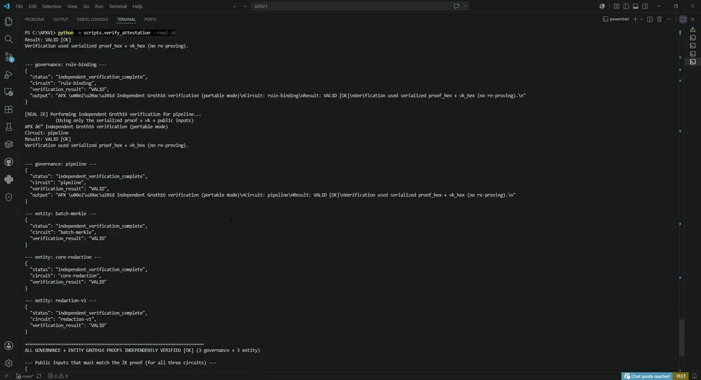

# APXV

[](https://github.com/APXV-Official/APXV/actions/workflows/ci.yml)

This repository is **APXV** (*Attested Proof Execution Verified*) — an air-gapped governed agent platform: markdown rules, signed capabilities, chained audit, Groth16 proofs, local API — bring your own LLMs. It ships **APXV1**, the first-generation open-source implementation.

> **Version:** 1.1.1 — see [CHANGELOG.md](CHANGELOG.md).

Run APXV1 locally. Your rules, data, artifacts, and cryptographic proofs stay on your machine. Build your own agents, workflows, and integrations on your infrastructure.

## Demo

**Video (v1.0.x):** text pipeline, dual-track Groth16 attestation, independent verify, optional E2EE (~2 min).

<a href="https://github.com/APXV-Official/APXV/blob/main/apxv1-demo.mp4">
  
</a>

**▶ [Watch demo video](https://github.com/APXV-Official/APXV/blob/main/apxv1-demo.mp4)**

**v1.1 walkthrough:** voice attest + ceremony checks — [docs/QUICKSTART.md](docs/QUICKSTART.md) (Voice attest and Ceremony transcript sections). The v1.0 demo video above covers text/E2EE only.

**Verifier bundle (VKs only):** download [`apxv1-verifier-bundle-v1.1.0.zip`](https://github.com/APXV-Official/APXV/releases/download/v1.1.0/apxv1-verifier-bundle-v1.1.0.zip) from the [v1.1.0 release](https://github.com/APXV-Official/APXV/releases/tag/v1.1.0), or build your own with `python -m scripts.export_verifier_bundle --out dist/apxv1-verifier-bundle-v1.1.0` after `setup_first_run`.

## Who This Is For

- **Developers** building privacy-preserving agent pipelines on local infrastructure
- **Companies** prototyping self-hosted governance without cloud dependency
- **Teams** that need auditable rule changes, immutable artifacts, and verifiable execution

APXV1 is a **foundation to build on** — not a finished end-user product.

## Extend APXV1

APXV1 is the **base platform**. Vertical work loads on top as **agent packs** — bundles of rules, workflows, agents, and capability policy for a use case. Install only the packs you need; mix and match on one runtime.

**Available today:**

- [Reference Redaction Pack](governance-libraries/apxv-pack-reference-redaction/) — official pack (governance + demo + acceptance)
- [Governance templates](governance-libraries/) — e.g. AI governance starter markdown (not a pack)

Build custom agents with [docs/BUILDING.md](docs/BUILDING.md).

**Roadmap:** AI Governance pack, document-processing pack, community packs. The core repo stays the runtime; packs extend it without bloating the base.

## What You Get

- **Governed agents** — read living markdown rules, workflows, and knowledge at runtime
- **Immutable artifacts** — SQLite + content-addressable storage
- **Chained audit logs** — every action recorded and verifiable
- **Signed capability policies** — agents only do what they're granted
- **Governance approval workflow** — propose → approve → apply rule changes
- **Redaction engine v3** — format-aware pattern redaction with structured `entities[]` output
- **Optional E2EE** — X25519 + XSalsa20-Poly1305 payload encryption (`--encrypt`)
- **Dual-track Groth16 ZK** — 3 governance circuits + up to 4 entity proofs per attest (8 entity circuits in crate; see [docs/cryptography/CIRCUITS.md](docs/cryptography/CIRCUITS.md))
- **Voice privacy suite** — STT → redact → attest with `voice-redaction` proof (simulated or local Vosk/pyttsx3)
- **Ceremony transparency (Tier A/B)** — VK manifest transcript (+ Ed25519 signature after `setup_first_run`) + publishable verifier bundle
- **Local HTTP API** — localhost only, no cloud, no telemetry
- **Pluggable LLMs** — bring Ollama or any backend via `LLMBackend` (optional)

## What It Does NOT Do

- Not HIPAA, SOC2, or GDPR certified
- Not full DLP-grade PII protection (pattern-based redaction)
- Not safe against malicious insiders with filesystem access
- Does not bundle an LLM — you add one if you need it

See [SECURITY.md](SECURITY.md) for the full threat model.

## Status

**v1.1.0** adds voice privacy (STT/TTS pipeline), Tier A/B ceremony tooling, and entity propagation fixes for multi-entity ZK proofs — on top of v1.0.x redaction, E2EE, and dual-track attestation. **311 automated tests pass in CI** (312 collected, 1 optional skip for local Vosk) covering text, voice, ceremony, packs, and ZK paths. See [CHANGELOG.md](CHANGELOG.md).

### Trust model

| You want to… | Trust |
|--------------|-------|
| Run APXV1 yourself (`setup_first_run`, your keys) | **Yourself** |
| Verify artifacts from a published release | **Publisher's setup** for those VKs (proof math is self-checking; setup honesty is separate) |

See [docs/cryptography/CEREMONY.md](docs/cryptography/CEREMONY.md). v1.1.0 uses single-party Groth16 trusted setup.

Reference Groth16 `.pk`/`.vk` files ship in the repository so install → attest works out of the box. For your own trust boundary, run `setup_first_run` and protect your proving keys — see [SECURITY.md](SECURITY.md) and [docs/cryptography/SETUP.md](docs/cryptography/SETUP.md).

## Quickstart

**Start here:** [docs/QUICKSTART.md](docs/QUICKSTART.md) (15 minutes)

### One-command install

**Windows:** `.\scripts\install.ps1`  
**macOS/Linux:** `./scripts/install.sh`

Requires Python 3.9+ and Rust ([install guide](docs/INSTALL-RUST.md)).

### Health check

```bash
python -m scripts.apx_doctor
python -m scripts.apx_ctl integrity
```

### API keys

```bash
python -m scripts.apx_ctl api-key create my-app
export APX_API_KEY="<key>"
python -m scripts.apx_serve
```

### Attestation (dual ZK)

```bash
python -m scripts.run_apx --attest
python -m scripts.run_apx --attest --encrypt   # optional E2EE
python -m scripts.verify_attestation --real-zk
```

### Voice + ceremony (v1.1)

```bash
pip install -e ".[dev,voice]"
python -m scripts.setup_voice                    # Vosk model for local STT
python -m scripts.run_apx --voice-transcript "Contact Jane at jane@example.com" --attest
python -m scripts.ceremony_transcript --write --tier B
python -m scripts.export_verifier_bundle --out dist/apxv1-verifier-bundle
```

## Build On APXV1

| Resource | Description |
|----------|-------------|
| [docs/BUILDING.md](docs/BUILDING.md) | **Start here** — agents, API, LLMs, deployment |
| [examples/hello-agent/](examples/hello-agent/) | Minimal custom governed agent |
| [examples/api-client/](examples/api-client/) | Python API client |
| [examples/llm-ollama/](examples/llm-ollama/) | Plug in a local Ollama LLM |
| [governance-libraries/](governance-libraries/) | Official packs and governance templates |

## Docker

See [docs/DOCKER.md](docs/DOCKER.md). Use **fresh volumes** for clean deploys.

```bash
docker compose up -d --build
curl http://127.0.0.1:8741/health
```

## Architecture


| Layer | Components |
|-------|------------|
| **Privacy** | `APXRedactionEngine`, optional `APXE2EE` |
| **Deterministic core** | RuleGovernedRedactor, WorkflowOrchestrator, AttestationCoordinator |
| **Agentic layer** | `LLMBackend`, `LLMReasoner`, `ToolUser`, `AgenticContract` |
| **Governance & control** | CapabilityChecker, AuditLogger, GovernanceRegistry |
| **Cryptographic layer** | Dual Groth16 tracks over BN254 (arkworks) |

## Documentation

| Doc | Purpose |
|-----|---------|
| [PROJECT-OVERVIEW.md](PROJECT-OVERVIEW.md) | Repository layout and components |
| [docs/QUICKSTART.md](docs/QUICKSTART.md) | Getting started |
| [docs/BUILDING.md](docs/BUILDING.md) | Extension patterns |
| [docs/INSTALL-RUST.md](docs/INSTALL-RUST.md) | Rust toolchain setup |
| [docs/DOCKER.md](docs/DOCKER.md) | Container deployment |
| [docs/AIR-GAP-INSTALL.md](docs/AIR-GAP-INSTALL.md) | Offline install |
| [docs/LOCAL-API.md](docs/LOCAL-API.md) | API reference |
| [SECURITY.md](SECURITY.md) | Threat model |
| [docs/cryptography/CIRCUITS.md](docs/cryptography/CIRCUITS.md) | Which circuits exist vs which run on `--attest` |
| [docs/cryptography/CEREMONY.md](docs/cryptography/CEREMONY.md) | ZK ceremony tiers and trust model |
| [docs/security/SECURITY-ARCHITECTURE.md](docs/security/SECURITY-ARCHITECTURE.md) | Security architecture |
| [CHANGELOG.md](CHANGELOG.md) | Release history |
| [CONTRIBUTING.md](CONTRIBUTING.md) | How to contribute |
| [RUNBOOKS/](RUNBOOKS/) | Deployment and operations |

## Backup

```bash
python -m scripts.apx_ctl backup-create
```

Back up `managed/`, `rust/apx-circuits/keys/`, and `rust/apx-zk/keys/` regularly.

## Support

APXV1 is open source (Apache 2.0).

- **Bugs and how-to:** [GitHub Issues](https://github.com/APXV-Official/APXV/issues) — include `python -m scripts.apx_doctor` output
- **Security:** [SECURITY.md](SECURITY.md) — do not post vulnerabilities in public issues
- **Contact:** [@APXVdev](https://github.com/APXVdev) · [APXVdev@protonmail.com](mailto:APXVdev@protonmail.com)

Community support is best-effort. Start with [docs/QUICKSTART.md](docs/QUICKSTART.md) and [docs/BUILDING.md](docs/BUILDING.md).

## Attribution

**APXV** is the platform; **APXV1** is the implementation line shipped from this repository. Neither is a registered trademark. If you build on APXV1, we appreciate (but do not require) a credit such as:

**Built with [APXV / APXV1](https://github.com/APXV-Official/APXV)** — *Attested Proof Execution Verified*

Please do not imply your project is an official APXV product unless you have a separate agreement with the maintainer.

## License

Copyright © 2026 [APXV Official](https://github.com/APXV-Official). Licensed under the [Apache License, Version 2.0](LICENSE). See [NOTICE](NOTICE) for redistribution attribution.
