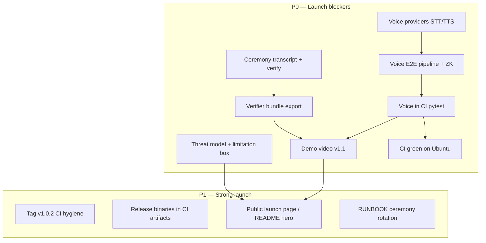

# APXV1 v1.1 — Public Launch Checklist

**Target:** Public launch with hardened ops, transparent ZK ceremony (Tier A/B), and voice privacy suite.  
**Baseline:** `main` @ v1.0.1 + CI fixes (`b8d72a9`).  
**Release tag:** `v1.1.0` (do not use for public narrative until all **P0** items are green).

---

## Launch tiers (what you promise publicly)

| Tier | Ceremony stance | Voice | Public claim |
|------|-----------------|-------|--------------|
| **v1.0.1** (shipped) | Single-party honest setup, documented | Circuit only (`voice-redaction` in `apx-zk`) | Private demo / technical preview |
| **v1.1.0** (launch bar) | Signed ceremony transcript + verifier bundle (Tier A/B) | Full STT → redact → attest → verify path | Public launch |
| **v1.2+** (optional) | MPC / multi-party ceremony (Tier C) | Production STT/TTS backends | Enterprise / crypto-native |

See [cryptography/CEREMONY.md](cryptography/CEREMONY.md) for ceremony tiers and transcript format.

---

## Dependency graph



---

## P0 — Launch blockers

### Ceremony (Tier A/B)

- [ ] **Generate transcript** after trusted setup:
  ```bash
  python -m scripts.ceremony_transcript --write
  python -m scripts.ceremony_transcript --verify
  ```
- [ ] Transcript includes governance + entity VK hashes, circuit versions, `setup_at`, operator note
- [ ] Optional Ed25519 signature over canonical transcript body (capability signing key or dedicated ceremony key)
- [ ] **Export verifier bundle** (VKs + manifests only, no PKs):
  ```bash
  python -m scripts.export_verifier_bundle --out dist/apxv1-verifier-bundle
  ```
- [ ] Third party can verify attestation with bundle + `verify_attestation --real-zk` (documented path)
- [ ] [cryptography/CEREMONY.md](cryptography/CEREMONY.md) reviewed; limitation box matches reality (no MPC unless implemented)
- [ ] `apx_doctor` check: `ceremony_transcript` valid when present

### Voice suite (Phase 5)

- [ ] `agents/voice/` — `APXSTTProvider` / `APXTTSProvider` + simulated backends for CI
- [ ] `VoicePrivacyPipeline`: audio/transcript → redact → `voice-redaction` public inputs
- [ ] Wire `voice-redaction` prove/verify in entity ZK bridge (or dedicated voice attest path)
- [ ] `tests/test_voice_suite.py` — round-trip without external APIs
- [ ] `tests/test_voice_e2e.py` — full: voice in → dual attest subset → `verify_attestation --real-zk` includes voice proof
- [ ] Sample audio fixture under `tests/fixtures/` (short synthetic or royalty-free clip, &lt; 500 KB)

### Hardening

- [ ] [SECURITY.md](../SECURITY.md) updated: ceremony tier, voice data flow, what ZK proves for voice
- [ ] [docs/security/SECURITY-ARCHITECTURE.md](security/SECURITY-ARCHITECTURE.md) — voice + ceremony sections
- [ ] Local API: document rate limits / max payload for voice endpoints (if exposed)
- [ ] Key backup RUNBOOK: governance keys, entity keys, ceremony transcript, capability signing key

### Demo & narrative

- [ ] Re-record demo per [DEMO-SCRIPT-V1.1.md](DEMO-SCRIPT-V1.1.md) (~3 min): text path + voice path + independent verify + ceremony mention
- [ ] Update `docs/assets/apxv1-demo-thumb.jpg` and `apxv1-demo.mp4` (or `apxv1-demo-v1.1.mp4`)
- [ ] README hero: public launch positioning (governed + verifiable + voice privacy)
- [ ] CHANGELOG `v1.1.0` section complete

### CI / release gate

```bash
cargo build --release --manifest-path rust/Cargo.toml -p apx-circuits -p apx-zk
cargo test -p apx-circuits -p apx-zk -q
python -m scripts.setup_first_run
python -m scripts.ceremony_transcript --verify
python -m scripts.apx_doctor
python -m scripts.apx_ctl integrity
python -m pytest tests/ -q --tb=short
```

- [ ] All steps pass on **ubuntu-latest** (GitHub Actions)
- [ ] Tag `v1.1.0` and GitHub Release with verifier bundle artifact

---

## P1 — Strong launch (same window if possible)

- [ ] Tag `v1.0.2` for CI-only fixes already on `main` (optional hygiene)
- [ ] CI uploads `apx-circuits` + `apx-zk` release binaries as workflow artifacts
- [ ] Docker image rebuild with ceremony + voice keys documented
- [ ] `install.ps1` / `install.sh` expected output strings include voice + ceremony
- [ ] Archive fence: `docs/archive/` banner “historical only”

---

## P2 — Post-launch

- [ ] Tier C MPC ceremony evaluation (snarkjs / N-party tooling)
- [ ] Production STT/TTS backends (Whisper local, Piper, etc.) behind provider interface
- [ ] Verifier WASM or standalone CLI distribution
- [ ] SOC2-oriented control mapping (if pursuing enterprise)

---

## File map (v1.1 work)

| Area | Path |
|------|------|
| Launch checklist | `docs/V1.1-PUBLIC-LAUNCH-CHECKLIST.md` (this file) |
| Ceremony spec | `docs/cryptography/CEREMONY.md` |
| Demo script | `docs/DEMO-SCRIPT-V1.1.md` |
| Ceremony CLI | `scripts/ceremony_transcript.py` |
| Verifier export | `scripts/export_verifier_bundle.py` |
| Voice module | `agents/voice/` |
| Voice tests | `tests/test_voice_suite.py` |
| Migration plan | `docs/APX-V1-MIGRATION-PLAN.md` Phase 5 |

---

## Sign-off

| Role | Name | Date | P0 complete |
|------|------|------|-------------|
| Engineering | | | [ ] |
| Security review | | | [ ] |
| Demo / narrative | | | [ ] |
| Public launch | | | [ ] |